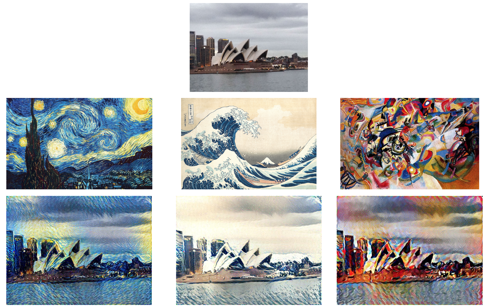

## neural style transfer
- notice: the code is tested in py3.5 environment with jpg format images
- guide
    - prepare
        - use pipenv to install the dependencies
        - download the vgg19 model from here: www.vlfeat.org/matconvnet/models/imagenet-vgg-verydeep-19.mat and put it in pretrained_model folder
        - generate style H file (it's needed only when you use patch based methods): put your style file at patch_based_fast_nst/style_image/style.jpg and run 'python calc_and_dump_style_h.py'
    - gatys slow transfer
        - the tranfer method used in this code is described here: https://arxiv.org/pdf/1508.06576.pdf
        - put the content.jpg into slow_nst/origin_image folder and put style.jpg into slow_nst/style_image folder
        - run command 'python main.py' to start transfer
    - patch based methods
        the methods is described here: https://arxiv.org/pdf/1612.04337.pdf
        - patch based bp transfer
            - put your origin images in patch_based_fast_nst/origin_image, run 'python patch_based_bp_nst.py'. it can transfer multiple images, the output will be in patch_based_fast_nst/output_image 
        - patch based fast nst
            - put mscoco2014 images (download from http://images.cocodataset.org/zips/train2014.zip and unzip) in patch_based_fast_nst/mscoco2014_images. run 'python train_fast_nst_model.py'. the model will be saved here: patch_based_fast_nst/model_files
            - put origin images in patch_based_fast_nst/origin_image and run 'python patch_based_fast_nst.py', the output will be in patch_based_fast_nst/output_image
- example(gatys methods)
    
    
- misc
    - generate images from video
        ffmpeg -i input.mp4 -qscale:v 2 tmp/video_%04d.jpg
    - generate video from images 
        ffmpeg -i output_image/%04d.jpg -c:v libx264 -pix_fmt yuv420p output.mp4